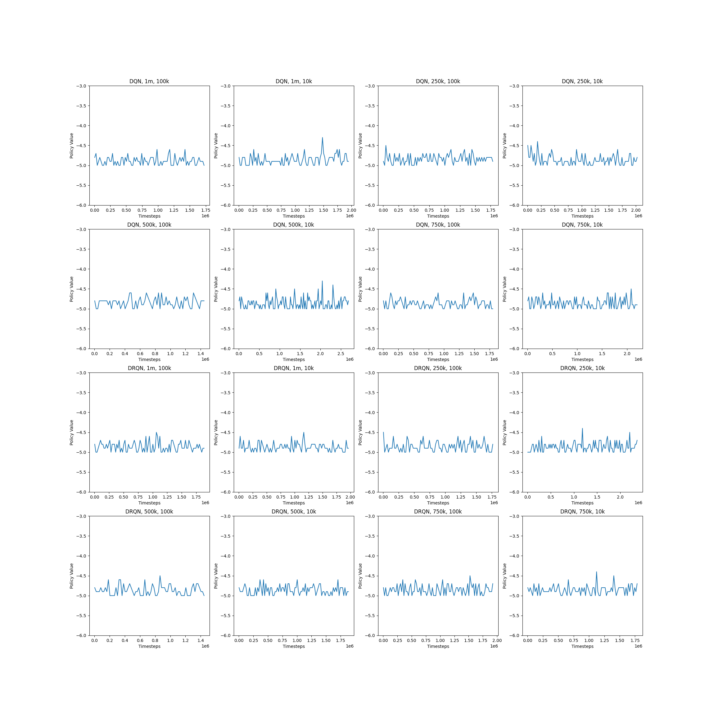

# Deep Recurrent Q-Learning Network for Partially Observable POMDPs

### Authors: Noam Siegel and Dolev Orgad
### Link to Youtube Explanation: [Link](https://youtu.be/FYhD57Dc8K0)
### Link to original paper: [Link](https://arxiv.org/abs/1507.06527)

## The paper and our main work
We implemented the paper named above in ~400 lines of python code.
We used the `TensorFlow.Keras` module to build 2 different Neural Networks:
DQN - The standard network suggested in the original DQN paper. It’ll be used as our baseline for comparing performance results.
DRQN - A variation of the DQN network in which the first fully connected layer is replaced with a recurrent LSTM layer of the same size.​

In order to reproduce the paper’s results we tested our models on the FrostBite Atari game. At some point, we realized that it’s not feasible to achieve the desired results with our time and compute resources limitations (the authors of the paper ran ~10 million steps of the model on dedicated hardware). Therefore, we changed the game to SlimeVollyGym which is less complex (only 6 output actions instead of 18), which we anticipated to be faster to converge.
Eventually it was not the case, 3 million steps were not enough so we concluded that these networks must run on dedicated hardware and for a sufficient amount of time, which is more than we have.

## Technical Details:
We used the Open AI Gym environment because it provides access to the ALE (Atari Learning Environments) emulator that can be easily adapted to test reinforcement learning algorithms.
We ran the models in the university GPU environment. It is a linux machine with a Slurm workload manager configured to run on many different types of GPUs.
We used RMSProp algorithm with minibatches of size 32.
The behaviour policy during training was epsilon-greedy with epsilon annealed linearly from 1.0 to 0.1 over some parameter number of steps, and fixed at 0.1 thereafter.
We checked two hyper-parameters:

1) Epsilon step - controls the length of the exploration period of the agent. The values we checked are 9e-7, 1.2e-6, 18e-6,3.6e-6 which correspond to 1m, 750k, 500k, 250k steps until epsilon reaches 0.1.

2) Buffer length - controls the amount of previously encountered experiences available to the agent. We checked the values 10k, 100k.

## How to run the code

`python RL211_HW5_V3.py -jid JOBID [-env ENV_NAME] [-network DQN/DRQN] [-maxsteps NUMBER] [-bufflen NUMBER] [-epsilonStep NUMBER]`

All arguments except job id will have a default value if not presented in the command.
The value of job id can be arbitrary if there is no need to keep track of multiple jobs running simultaneously.

## An example run command:
`python RL211_HW5_V3.py -jid 99999 -env SlimeVolleyNoFrameskip-v0 -network DRQN -maxsteps 1000000 -bufflen 40000 -epsilonStep 0.0000018`

## References
[Deep Recurrent Q-Learning for Partially Observable MDPs, Matthew Hausknecht and Peter Stone](https://arxiv.org/abs/1507.06527)

[Human-level control through deep reinforcement learning, Mnih et. al.](https://www.nature.com/articles/nature14236)

[Open AI Gym](https://gym.openai.com/)

[SlimeVolleyGym](https://github.com/hardmaru/slimevolleygym)

### Our performance graphs:

